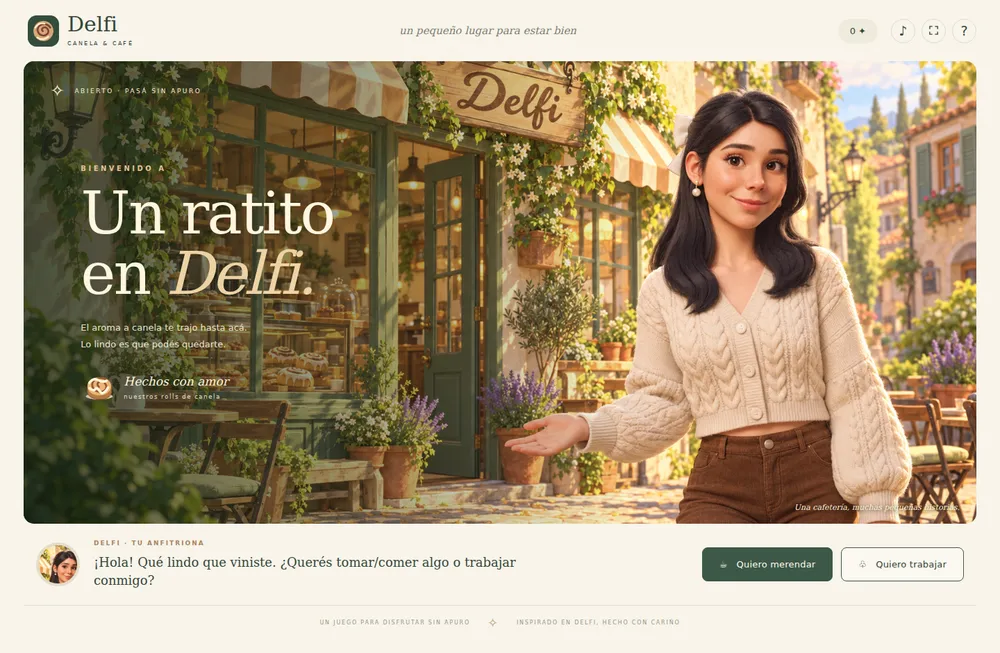

# Delfi · Canela & Café

Un juego cozy en español para PC, inspirado en Delfi. Afuera de la cafetería, Delfi te recibe y te invita a **merendar** o a **trabajar con ella**. Ilustraciones cálidas, rolls de canela y una partida sin apuro.



## Jugar ahora, sin instalar nada

1. Extraé todo el ZIP a una carpeta.
2. Abrí `index.html` con Chrome, Edge o Firefox. En Windows también podés hacer doble clic en `JUGAR_EN_WINDOWS.bat`.
3. Elegí **Quiero merendar** o **Quiero trabajar**.

El juego funciona sin conexión. No necesita cuenta, servidor, claves ni dependencias para jugar en el navegador. No abras el HTML directamente dentro del ZIP: primero extraelo. F11 o el botón ⛶ amplían la pantalla.

## Los dos modos

**Merendar:** elegí una de cuatro ubicaciones, pedí hasta cuatro productos, seleccioná el frosting de tus rolls y esperá a que Delfi te sirva. Hacé clic en los productos para disfrutar la merienda. Las visitas son gratis; los precios son valores ficticios para el modo trabajo.

**Trabajar:** atendé cinco clientes por turno. Leé el ticket, elegí una estación, completá los pasos de la receta, frená el horno en la zona verde, seleccioná el frosting indicado y serví en plato o caja según corresponda. Los pedidos incorrectos no se entregan: podés corregirlos. Cada entrega suma monedas y propina. Al cerrar el turno podés regalar una planta a la cafetería.

No hay penalizaciones por tardar. Los pasos de cocina representan un minijuego y no son instrucciones culinarias reales.

## Menú completo (32 opciones)

- **Dulces (11):** roll de canela; roll de canela y manzana; carrot cake; crumble de manzana; crumble de manzana y frutos rojos; cookies de gatitos; budín de limón; brownie; torta marmolada; galletitas danesas; alfajor ferrero.
- **Frostings:** crema, crema y lavanda, crema con chocolate.
- **Salados (7):** scones de queso; sándwich de lomito, queso crema y rúcula; sándwich capresse; tostón de palta, huevo y verdes; sándwich italiano en ciabatta con muzzarella fresca, pesto, lomito, tomate, aceite de oliva y rúcula; scones de espinaca y queso; tabla de quesos suaves, azules y de cabra con uvas, peras, higos, frutos secos y mermelada.
- **De copa (9):** yogurt con granola y frutos rojos; tarta frutal; ensalada de frutas; helado; mousse de chocolate; mousse de limón; chocoflan; tiramisú; cheesecake de frutos rojos.
- **Bebidas (5):** café con leche, espresso, té de lavanda, chocolate caliente y limonada.

## Controles y guardado

- Mouse: todas las interacciones.
- `1` / `2`: elegir modo desde la entrada.
- `Escape`: cerrar menú, ayuda o cancelar una preparación.
- `Tab` / `Enter`: recorrer y activar botones.
- ♪: activar o desactivar la música instrumental sintetizada.

Se guardan monedas, pedidos completados, visitas, turnos y planta en `localStorage` del navegador. La preparación en curso no se guarda. Cambiar de navegador, mover el archivo local o borrar los datos del navegador puede cambiar o eliminar el guardado. La aplicación de escritorio tiene su propio guardado.

## Tecnologías

HTML, CSS y JavaScript, sin framework ni llamadas de red durante el juego. Ilustraciones de escenarios generadas para este proyecto; platos dibujados en SVG desde código; sonidos y música sintetizados con Web Audio. Electron es una opción para empaquetar el mismo juego como aplicación de escritorio.

Es una primera versión 2D interactiva con escenas ilustradas, no un entorno 3D de movimiento libre.

## Desarrollo

Node.js 24 recomendado.

```sh
npm start
# Abrir http://localhost:4173
npm test
```

Para las pruebas de navegador:

```sh
npm ci
npx playwright install chromium
npm run test:ui
```

El juego no necesita `npm install` para ejecutarse como HTML ni para las pruebas unitarias.

## Aplicación para Windows (opcional)

```sh
npm ci
npm run desktop
npm run build:windows
```

El resultado queda en `dist/Delfi-Cafe-win32-x64/`. Ejecutá `Delfi-Cafe.exe` manteniendo los demás archivos de esa carpeta. También podés usar **Actions → Crear juego para Windows → Run workflow** en GitHub y descargar el artefacto cuando termine. El ZIP de código incluye la configuración; no incluye un ejecutable Windows compilado ni firmado. El empaquetado Windows requiere descargar Electron durante la construcción.

## GitHub

La carpeta contiene el código completo, las imágenes necesarias, pruebas y workflows. Para un repositorio nuevo:

```sh
git init -b main
git add .
git commit -m "Crear Delfi Canela y Cafe"
git remote add origin URL_DE_TU_REPOSITORIO
git push -u origin main
```

Para jugar online desde GitHub Pages: en un repositorio compatible con Pages, configurá **Settings → Pages → Deploy from a branch → main / (root)**. La aplicación es estática y usa rutas relativas.

## Estructura

- `index.html`: inicio.
- `style.css`: interfaz, escenas y animaciones.
- `game.js`: estados, pedidos, cocina, interacción, arte de platos y audio.
- `menu.js`: productos, recetas, frostings y validación de pedidos.
- `assets/`: arte exterior, interior e icono.
- `tests/`: pruebas de reglas y flujo de juego.
- `desktop.cjs`: ventana Electron aislada, sin acceso Node desde el juego.
- `server.cjs`: servidor de desarrollo local.
- `ART_PROMPTS.md`: procedencia y prompts de las ilustraciones.

La fotografía de referencia original no se incluye en el repositorio. No se define una licencia pública sobre la identidad de Delfi ni sobre el proyecto; el propietario puede decidirla antes de distribuirlo.
